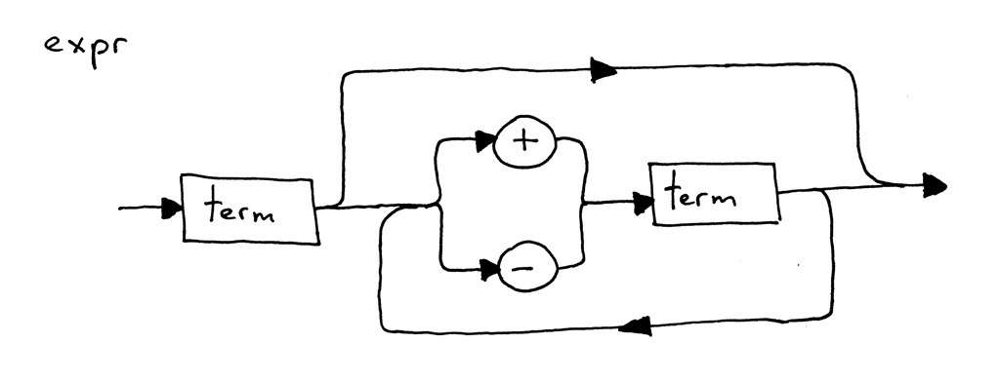

# Let's Build a Simple Interpreter

"If you don't know how compilers work, then you don't know how computers work. If you're not 100% sure whether you know how compilers work, then you don't know how they work" - Steve Yegge

# [Part 1](https://ruslanspivak.com/lsbasi-part1/)

## Why to study interpretersf and compilers?

1. To write an interpreter or a compiler you have to have a lot of technical skills that you need to use together. Writing an interpreter or a compiler will help you improve those skills and become a better software developer. As well, the skills you will learn are useful in writing any software, not just interpreters or compilers.
2. You really want to know how computers work. Often interpreters and compilers look like magic. And you shouldn’t be comfortable with that magic. You want to demystify the process of building an interpreter and a compiler, understand how they work, and get in control of things.
3. You want to create your own programming language or domain specific language. If you create one, you will also need to create either an interpreter or a compiler for it.

The goal of an **interpreter** or a **compiler** is to **translate a source program in some high-level language into some other form**. Pretty vague, isn’t it? Just bear with me, later in the series you will learn exactly what the source program is translated into.

This project will create a simple interpreter for a large subset of [Pascal](https://en.wikipedia.org/wiki/Pascal_%28programming_language%29) language.

## Process

In order for the interpreter to actually understand what to do with that string it first needs to break the input "1+2" into components called **tokens**. A token is an object that has a type and value.

The process of breaking the input string into tokens is called **lexical analysis**. The first step of the interpreter is reading the input and convert it into **a stream of tokens**. The part of interpreter is called **lexical analyzer**, or **lexer** for short, other names are **scanner** or **tokenizer**.

A **lexeme** is a sequence of characters that form a token. e.g. 123 is an integer token.

The process of finding the structure in the stream of tokens, or put differently, the process of recognizing a phrase in the stream of tokens is called **parsing**. The part of an interpreter or compiler that performs that job is called a **parser**.

A **syntax diagram** is a graphical representation of a programming language’s syntax rules. Basically, a syntax diagram visually shows you which statements are allowed in your programming language and which are not.



Syntax diagrams are pretty easy to read: just follow the paths indicated by the arrows. Some paths indicate **choices**. And some paths indicate **loops**.

Syntax diagrams serve two main purposes:

* They graphically represent the specification (grammar) of a programming language.
* They can be used to help you write your parser you can map a diagram to code by following simple rules.

Parsing is also called **syntax analysis**, and the parser is also aptly called a **syntax analyzer**.

The parser just recognizes the structure making sure that it corresponds to some specifications and the interpreter actually evaluates the expression once the parser has successfully recognized (parsed) it.

## Grammars

**context-free grammars (CFG)** or **BNF** (Backus-Naur Form) or [EBNF notation](https://en.wikipedia.org/wiki/Extended_Backus%E2%80%93Naur_form).

### Here are a couple of reasons to use grammars:

* A grammar specifies the syntax of a programming language in a **concise** manner. Unlike syntax diagrams, grammars are very compact.
* A grammar can serve as great documentation.
* A grammar is a good starting point even if you manually write your parser from scratch. Quite often you can just convert the grammar to code by following a set of simple rules.
* There is a set of tools, called **parser generators**, which accept a grammar as an input and automatically generate a parser for you based on that grammar.

A grammar consists of a sequence of **rules**, also known as **productions**.

A rule consists of a non-terminal, called the **head** or **left-hand side** of the production, a colon, and a sequence of terminals and/or non-terminals, called the **body** or **right-hand side** of the production.

```shell
expr: factor ((MUL|DIV) factor)*
factor: INTEGER
```

In the grammar above, tokens like MUL, DIV, and INTEGER are called **terminals** and variables like expr and factor are called **non-terminals**. Non-terminals usually consist of a sequence of terminals and/or non-terminals. The non-terminal symbol on the left side of the first rule is called the **start symbol**. In the case of our grammar, the start symbol is expr.

A grammar defines a language by explaining what sentences it can form. This is how you can derive an arithmetic expression using the grammar: first you begin with the start symbol expr and then repeatedly replace a non-terminal by the body of a rule for that non-terminal until you have generated a sentence consisting solely of terminals. Those sentences form a language defined by the grammar.

If the grammar cannot derive a certain arithmetic expression, then it doesn’t support that expression and the parser will generate a syntax error when it tries to recognize the expression.

### Convert the grammar to source code

* Each rule, R, defined in the grammar, becomes a method with the same name, and references to that rule become a method call: R(). The body of the method follows the flow of the body of the rule using the very same guidelines.
* Alternatives (a1 | a2 | aN) become an if-elif-else statement.
* An optional grouping (…)* becomes a while statement that can loop over zero or more times
* Each token reference T becomes a call to the method eat: eat(T). The way the eat method works is that it consumes the token T if it matches the current lookahead token, then it gets a new token from the lexer and assigns that token to the current_token internal variable.

### Associativity and Precedence

In ordinary arithmetic and most programming languages addition, subtraction, multiplication, and division are **left-associative**.

In the arithmetic that we know and use, multiplication and division have **higher precedence** than addition and subtraction.

Here are the rules for **how to construct a grammar from the precedence table**:

* For each level of precedence define a non-terminal. The body of a production for the non-terminal should contain arithmetic operators from that level and non-terminals for the next higher level of precedence.
* Create an additional non-terminal factor for basic units of expression, in our case, integers. The general rule is that if you have N levels of precedence, you will need N + 1 non-terminals in total: one non-terminal for each level plus one non-terminal for basic units of expression.


